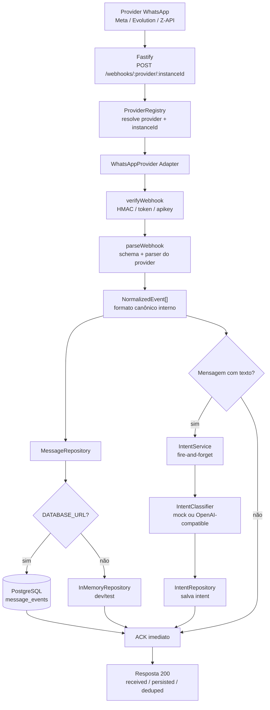

# Fluxo de arquitetura — SuperSDR

Este diagrama resume o caminho de um webhook desde a chegada no servidor até a normalização, persistência e classificação de intenção.

## Ponto de extensibilidade

Para adicionar um novo provedor, crie um adapter que implemente `WhatsAppProvider` e registre a instância no `ProviderRegistry`. A rota HTTP, o repositório e o `IntentService` continuam consumindo apenas `NormalizedEvent[]`.
